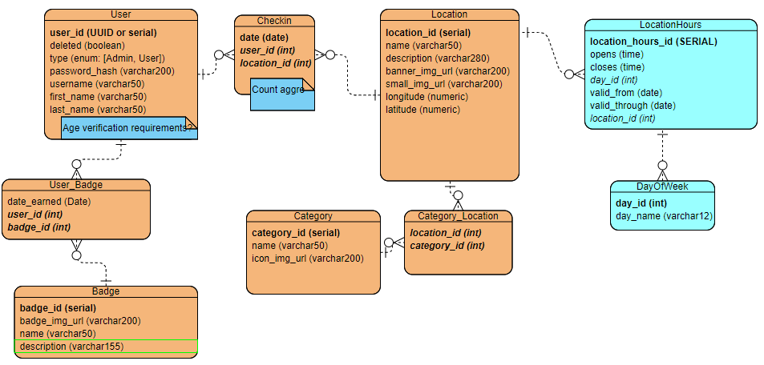

# Final Capstone

This directory contains all of the starter projects for the final capstone. The Vue starter project works with both the Java and .NET backend projects with a single configuration update that you can read about in the README. Each project contains instructions that provides information about the starting code and explains how to get started with the final capstone project.

## Overview

### Getting Started

* Make sure to run Schema.sql before looking at the most current version of the code

### General Conventions

* locationId - Java and JavaScript use camelCase names
* bannerImgURL - URL is all capital so be careful with that

### Database

PostgreSQL



References:
* Longitude and latitude lookup: 
  * https://www.latlong.net/place/san-diego-zoo-san-diego-ca-usa-26202.html
  * Wikipedia
  * Google Maps

### Backend Server

Java

Endpoints: 
* "/api": base URL
* "/locations": list all locations from database
* "/locations/{locationID}": returns detailed information about one specific location
* "/categories": returns all location categories
* "/users": list all users (admin access only)
* "/users/{userID}": returns detailed information about one specific user (that user access only)
* "/users/{uerId}/location/{locationId}": allows posting of new data to the checkin table
* "users/{userId}/badge": retrieves all badges, including information on whether a user has earned them yet

### Frontend Application

Vue

Consumed APIs:
* Backend server for in-house data
* Mapbox for map functionality

Pages:
On every page (except login and register):
  * SearchBar
    * CategoryIcon
  
* Home
  * SearchBar
  * HomePage
    * LocationsList
      * LocationCard
        * CategoryIcon - return a row of categories the location belongs to
* SearchBar
  * CategoryIcon - return a row of all categories
* Results
  * SearchBar
  * LocationsList
  * LocationMap
* LocationDetails
  * LocationHours - returns info on hours
  * CategoryIconList - fills in all category icons
  * SingleDestination - provides map with directions
* Profile
  * UserDetails
    * BadgeShelf - earned & unearned
      * BadgeIcon
    * CheckinContainer
      * CheckinCard
        * LocationCard

### Image sources

* Category icons

    Attribution: 
  ```html 
  <div>Icons made by <a href="http://www.freepik.com/" title="Freepik">Freepik</a> from <a href="https://www.flaticon.com/" title="Flaticon">www.flaticon.com</a></div>
  ```
  * Beach: https://image.flaticon.com/icons/svg/2918/2918660.svg
  * Park: https://image.flaticon.com/icons/svg/941/941543.svg
  * Museum: https://image.flaticon.com/icons/svg/3068/3068691.svg
  * Restaurant: https://image.flaticon.com/icons/svg/685/685352.svg
  * Sports Stadium: https://image.flaticon.com/icons/svg/821/821357.svg